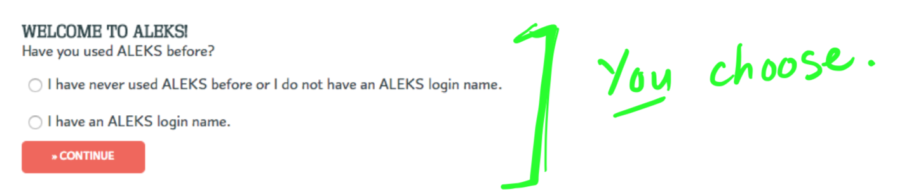
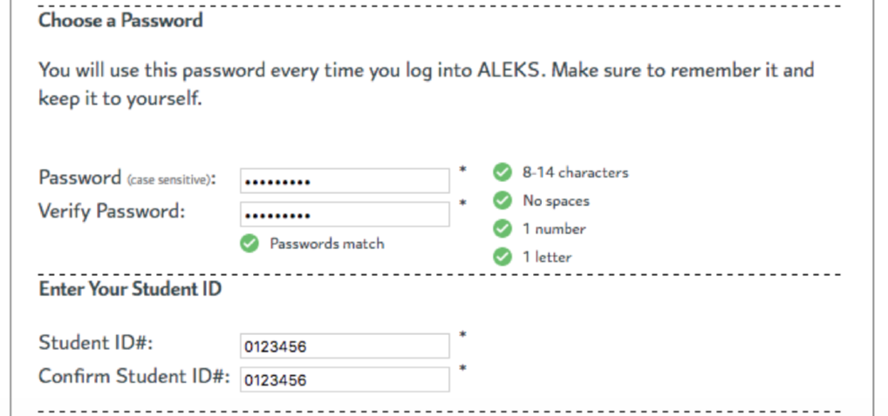
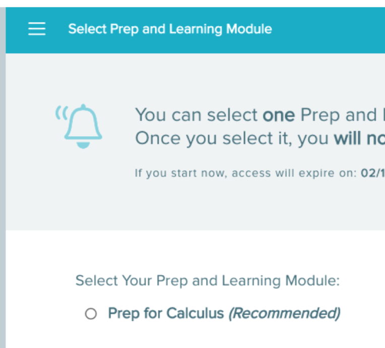

## Week 1 Logistics

The first homework and quiz of the class use the online software ALEKS PPL to help you review past prerequisite skills.  You need to accomplish the following steps.

1. By Tuesday, August 28, log into ALEKS PPL **using the 
   instructions below**.  This is a different process from the 
   UAF ALEKS placement test you may have used in the past.

2. Take an initial assessement in ALEKS PPL by Wednesday, August 29.  This
   assessment will be used to determine the skills you need to practice.

3. Using ALEKS PPL's learning mode, either complete 90% of your pie, or spend
   10 hours in it reviewing.  You have until the end of the day of Monday, September 3 to finish this task, which will count as your first homework grade.

4. Schedule a two-hour timeslot to take Quiz 1 on Tuesday, September 4.

## How to first log into ALEKS PPL.

1. You will need two codes before you begin
	* The course code, **L39JV-4W9Q4**.
	* Your personal ALEKS access code, which you can access
	  from within BlackBoard.  Go to our course and then `My Grades`.  Your
	  ALEKS access code will be the first entry in the grade spreadsheet.

2. Go to [ALEKS](https://www.aleks.com) and click on the yellow new
   student button.

   {: width="250px"}

3. Enter the class code **L39JV-4W9Q4** in the next screen.

   {: width="250px"}

4. After confirming that you are enrolling in our cohort, you will be asked
   if you already have an ALEKS login name or not.  If you do, and you remember
   its password, you are welcome to use it.  Otherwise, proceed as a new 
   user.

   {: width="500px"}

5. In the following Course Access page, select the "I have non-ecommerce access to ALEKS" option (it's in small red letters!). 

   {:width="500px"}

5. Then enter your individual ALEKS access code.

   {:width="500px"}

6. You will be asked for student information at this point. It is essential
that you enter your UAF student ID correctly on this page; this is how we
will identify your score and give you credit for your work.

   {:width="500px"}

## Working with ALEKS PPL

When you have logged in to ALEKS PPL, it will give you a tutorial on how
to use the interface.  When you are done with that tutorial, you will
start your Initial Assessment.  This can take up to two hours, and is used to 
determine your skills and select appropriate problems for you to work on in the
future. When your assessment is done, you'll receive a score between 0 and 100.

After your assessment is complete, you'll want to start working with the Prep and Learning Module.  There is only one choice for the learning, module, **Prep for Calculus**, and you'll want to be using it.

   {:width="300px"}

You'll need to either spend at least 10 hours using the learning module, or complete 90% of your pie.  You can see your progress by clicking on Reports
in the menu at the upper left-hand corner of the learning module screen.
